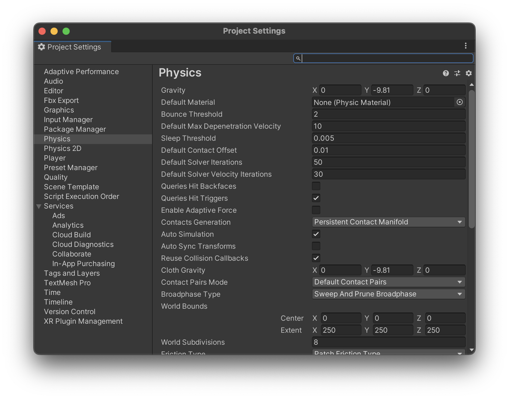

# OperaSim-PhysX
Simulator on Unity + PhysX communicating with ROS

## Overview
- This simulator is part of the autonomous construction technology development platform OPERA (Open Platform for Earth work with Robotics and Autonomy) and is available for anyone to use
- It uses [Unity](https://unity.com/) as the simulator platform and [Nvidia PhysX](https://www.nvidia.com/ja-jp/drivers/physx/physx-9-19-0218-driver/) as the physics engine
- Since it uses Unity, a Unity license appropriate for your organization is required. Please check [Unity's official website](https://store.unity.com/ja) for details and register for usage.


## Installation Method
### 1. Installing Unity (ver:2022.3.4f1)

Install UnityHub according to your PC's OS as follows:

- For Windows or Mac: [https://unity3d.com/jp/get-unity/download](https://unity3d.com/jp/get-unity/download)
- For Linux (Linux version not tested): [https://unity3d.com/get-unity/download](https://unity3d.com/get-unity/download)

### 2. How to Open Project Files and Download Unity Editor
- Launch UnityHub, click "Add" in the top right of the screen and select `OperaSim_PhysX` (downloaded from Github to your PC) (initial startup may take several minutes). When clicking, select and download the specified Unity Editor.

### 3. Selecting Scene File
- Open the demo sample Scene file located in `Asset/Scenes/SampleScene.unity`.

### 4. ROS-TCP-Connector Settings
- Open Robotics > ROS Setting from the Unity Editor's top toolbar and enter the ROS-side IP address and port number (default is 10000) in "ROS IP Address" and "ROS Port"
- If using ROS2, change "Protocol" from "ROS1" to "ROS2"


### 5. How to Connect with ROS

- [First time only] Clone the [ROS-TCP-Endpoint](https://github.com/Unity-Technologies/ROS-TCP-Endpoint) package on the ROS side, build and set up.
For ROS 1:
  ```bash
  $ cd (ROS workspace)/src
  $ git clone https://github.com/Unity-Technologies/ROS-TCP-Endpoint.git
  $ cd ./ROS-TCP-Endpoint/
  $ sudo chmod +x setup.py
  $ ./setup.py
  $ catkin build ros_tcp_endpoint
  $ source ../../devel/setup.bash
  ```
For ROS 2:
  ```bash
  $ cd (ROS workspace)/src
  $ git clone -b https://github.com/Unity-Technologies/ROS-TCP-Endpoint.git
  $ cd ./ROS-TCP-Endpoint/
  $ sudo chmod +x setup.py
  $ ./setup.py
  $ catkin build ros_tcp_endpoint
  $ source ../../devel/setup.bash
  ```
- Execute endpoint.launch on the ROS side
  ```bash
  $ roslaunch ros_tcp_endpoint endpoint.launch
  ```
- Click the execute button at the top of Unity Editor


- Launch the unity launch file for the corresponding construction machine on the ROS side
  - Hydraulic Excavator
  ```bash
  $ roslaunch zx120_unity zx120_standby.launch
  ```
  - Crawler Dump
  ```bash
  $ roslaunch ic120_unity ic120_standby.launch
  ```

#### Data Sent/Received with ROS
- Cmd (ROS -> Unity)

| Data Content | Topic Name | Topic Type | Physical Quantity | Unit | Remarks |
| ----  |  ---- | ---- | ---- | ---- | ---- |
| Ground speed command value for machine's moving parts | /(machine ns)/tracks/cmd_vel | geometry_msgs/Twist | Velocity | [m/s],[rad/s] |  |
| Dump truck bed tilt angle command value | /(machine ns)/vessel/cmd | std_msgs/Float64 | Angle | [rad] |  |
| Machine swing axis angle command value | /(machine ns)/swing/cmd | std_msgs/Float64 | Angle | [rad] |  |
| Machine boom axis angle command value | /(machine ns)/boom/cmd | std_msgs/Float64 | Angle | [rad] |  |
| Machine arm axis angle command value | /(machine ns)/arm/cmd | std_msgs/Float64 | Angle | [rad] |  |
| Machine bucket axis angle command value | /(machine ns)/bucket/cmd | std_msgs/Float64 | Angle | [rad] |  |

- Res (Unity -> ROS)

| Data Content | Topic Name | Topic Type | Physical Quantity | Unit | Remarks |
| ----  |  ---- | ---- | ---- | ---- | ---- |
| Machine base link coordinates | /(machine ns)/base_link/pose | geometry_msgs/PoseStamped | Position/Pose | Position:[m] Pose:[-] | True value of coordinates relative to Unity's world coordinate system |
| Machine odometry calculation results | /(machine ns)/odom | nav_msgs/Odometry | Odometry | Position:[m] Pose:[-] | Calculated with initial position as origin |
| Machine joint angles/angular velocities | /(machine ns)/joint_states | sensor_msgs/JointState | Angle/Angular Velocity | Angle:[rad] Angular Velocity:[rad/s] | See next section for effort |

### Enabling Joint Torque Sensors

You can output effort values from the joint_states topic by checking "Enable Joint Effort Sensor" in the `Joint State Publisher` script set for each game object.


> **Note**
> Please note that joint torque sensors are often not available on actual machines.

## How to Tune Parameters

### Tuning Joint Control Parameters

Control parameters for each joint can be modified by changing the XDrive parameters of the game objects.


| Property Name | Description |
| ----  |  ---- |
| Lower Limit | Lower limit of joint motion angle (unit: degree). To enable motion angle limits, set the Motion property to "Limited" |
| Upper Limit | Upper limit of joint motion angle (unit: degree). To enable motion angle limits, set the Motion property to "Limited" |
| Stiffness | Joint stiffness coefficient. See equation below for coefficient meaning. If 0, uses default value 20000 |
| Damping | Joint damping coefficient. See equation below for coefficient meaning. If 0, uses default value 10000 |
| Force Limit | Maximum torque applied during control (unit: newton). If 0, uses default value 10000 |

Stiffness and Damping coefficients are used in the following equation:

Applied Torque = Stiffness * (Drive Position - Target Position) - Damping * (Drive Velocity - Target Velocity)

For more detailed explanations of these parameters, please refer to Unity's official manual:

https://docs.unity3d.com/ja/2023.2/Manual/class-ArticulationBody.html#joint-drive-properties

### Tuning Simulation Parameters When Joint Control Becomes Oscillatory

When simulating multi-joint heavy machinery with long links, joint control may become oscillatory.
This symptom can be mitigated by the following adjustment:

Select `Edit > Project Settings...` from the menu and choose the `Physics` item.



Change the `Default Solver Iterations` property value to a larger number.

### Adjusting Particle Simulation Behavior

Soil particle simulation parameters can be changed in the Soil Particle Setting of the Terrain game object.


| Property Name | Description |
| ----  |  ---- |
| Enable | Uncheck this checkbox if you want to disable soil particle simulation. |
| Particle Visual Radius | Sets the visual radius of particles. To set the radius at which particles interact with each other, also adjust the RockPrefab settings below. |
| Particle Stick Distance | You can recreate soil viscosity by applying attractive forces between nearby particles. This sets the range for generating attractive forces. |
| Stick Force | Sets the strength of attractive forces generated between nearby particles. |

To adjust the radius at which particles interact with surrounding particles, change the Radius value of the Sphere Collider in RockPrefab.

